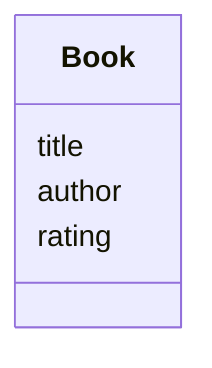
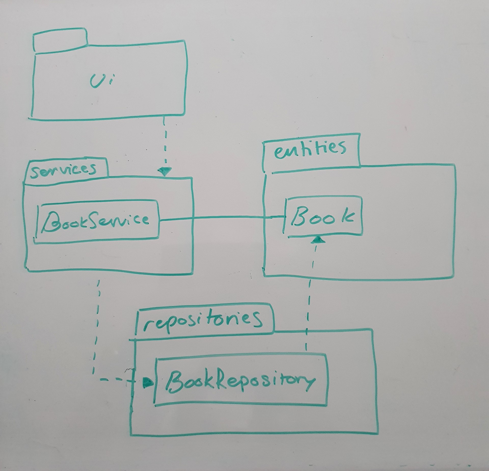

## Sovelluslogiikka

Login kirjat kuvataan Book- luokassa:

BookServicessä on yksi luokka. Alla listattuna sen tähänastiset metodit.

- `add_new_book(title, author, rating)`
- `browse_all_books()`

_BookService_ on yhteydessä [BookReporitory](https://github.com/Mahlamaki/ot-harjoitustyo/blob/main/src/repositories/book_repository.py)yn, jonka kautta saadaan hoidettua tietokantaannan kanssa kommunikointi.

Projektin luokka/pakkauskaavio:

## Päätoiminnallisuudet

Alla päätöiminnallisuuksien sekvenssikaaviot

### Uuden kirjan lisääminen

Kun etusivulta valitaan "Lisää kirja" päästään AddBook näkymään. Siellä täytetään kirjan lisäämiseen tarvittavat kentät ja painetaan "Tallenna". Alla näet, miten kirjan luonti tapahtuu sovelluksen sisällä:

"Tallenna"- napin jälkeen kutsutaan BookServicen Add_new_book(), joka saa parametreinaan kirjan nimen, kirjoittajan ja arvosanan. BookServicesta nämä tiedot menevät Book luokalle, jossa tiedoista muodostetaan Book-olio. Book olio annetaan sitten BookServicessä parametrina BookRepositorylle, joka hoitaa add() funktiolla kirjan lisäämisen tietokantaan. Tämän jälkeen näkymä palautuu takaisin etusivulle.

