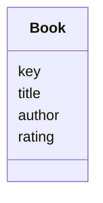
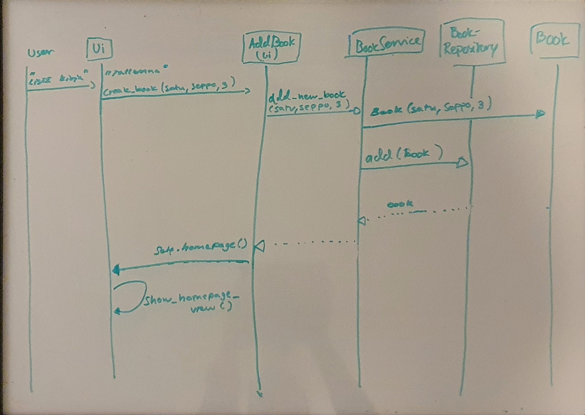

## Sovelluslogiikka

Login kirjat kuvataan Book- luokassa:

BookServicessä on yksi luokka. Alla listattuna sen metodit.

- `add_new_book(title, author, rating)`
- `browse_all_books()`
- `delete_book(book)`
- `all_authors()`
- `all_ratings()`
- `get_wishlist()`
- `add_to_wishlist(book_title, author)`
- `remove_from_wishlist(key)`
- `generate_key(title,author)`

_BookService_ on yhteydessä [BookReporitory](https://github.com/Mahlamaki/ot-harjoitustyo/blob/main/src/repositories/book_repository.py)yn, jonka kautta saadaan hoidettua tietokantaannan kanssa kommunikointi. Lisäksi BookService on yhteydessä Book-luokkaan, jonka avulla muodostetut book-oliot lisätään tietokantaan.

BookRepositoryssä on yksi luokka. alla sen metodit.

- `fetch_all()`
- `add(book)`
- `browse()`
- `delete_selected_book(key)`
- `delete_all()`
- `get_authors()`
- `get_ratings()`
- `get_all_from_wishlist()`
- `add_to_wishlist(book)`
- `delete_from_wishlist(key)`

Projektin luokka/pakkauskaavio:

## Päätoiminnallisuudet

Alla päätöiminnallisuuksien sekvenssikaaviot

### Uuden kirjan lisääminen

Kun etusivulta valitaan "Lisää kirja" päästään AddBook näkymään. Siellä täytetään kirjan lisäämiseen tarvittavat kentät ja painetaan "Tallenna". Alla näet, miten kirjan luonti tapahtuu sovelluksen sisällä:

"Tallenna"- napin jälkeen kutsutaan BookServicen Add_new_book(), joka saa parametreinaan kirjan nimen, kirjoittajan ja arvosanan. BookServicesta nämä tiedot menevät Book luokalle, jossa tiedoista muodostetaan Book-olio. Book olio annetaan sitten BookServicessä parametrina BookRepositorylle, joka hoitaa add() funktiolla kirjan lisäämisen tietokantaan. Tämän jälkeen näkymä palautuu takaisin etusivulle.

