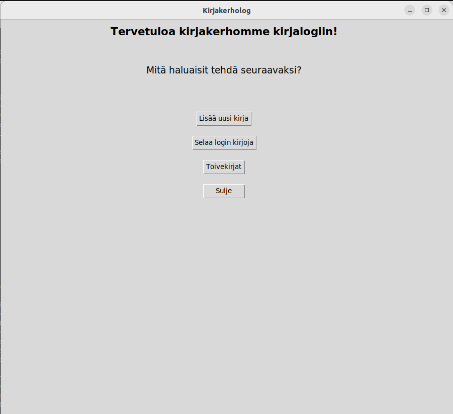
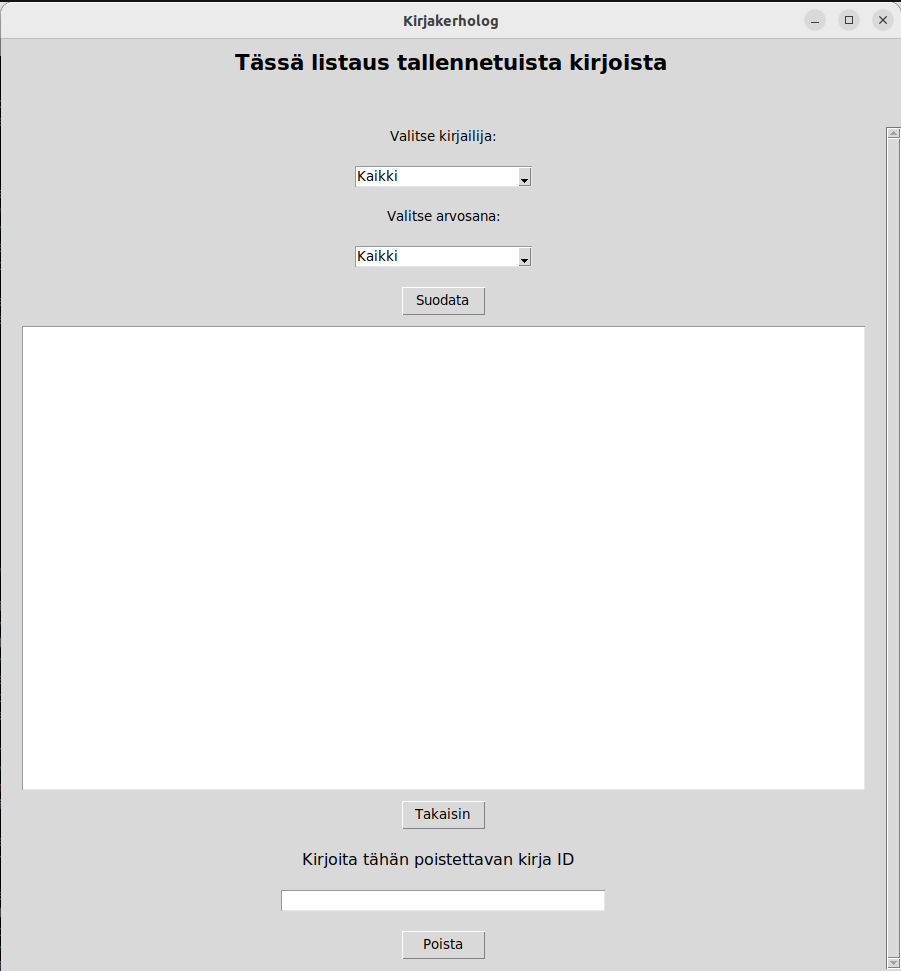

# Käyttöohje

## Käynnistysohje


Ensin asenna riippuvuudet:
```
poetry install
```

Alusta tietokanta:
```
poetry run invoke build
```

Ja lopuksi käynnistä sovellus:
```
poetry run invoke start
```

## Etusivu

Sovellus avautuu etusivunäkymään:



Etusivulta pääsee siirtymään kahteen uuteen näkymään, kirjanlisäykseen ja kirjojen selaukseen. Sulje- painikkella saa suljettua sovelluksen.

## Uuden kirjan lisääminen

Kun etusivulla on painettu "Lisää uusi kirja" - painiketta, päästään kirjanlisäysnäkymään:


Ensimmäiseen kenttään kirjoitetaan kirjan nimi, jossa tulee 2-35 merkkiä.
Toiseen kenttään kirjoitetaan kirjoittajan nimi, jossa tulee olla 1-35 merkkiä.
Viimeiseen kenttään merkataan kirjalle annettu arvosana, ja sen tulee olla kokonaisluku 1-5 välillä.
Lopuksi, jos ollaan tyytyväisiä, voidaan tallentaa kirja tietokantaan painamalla "Tallenna"- painiketta. 
Voidaan myös palata takaisin etusivulle "Takaisin"- painikkeella.

## Kirjojen selaaminen

Kun etusivulla on painettu "Selaa login kirjoja"- painiketta, aukeaa kirjojen selausnäkymä:



Aluksi selaussivulle on listattu kaikki login kirjat. Niitä voi kuitenkin filtteröidä listauksen yläpuolella olevilla alasvetovalikoilla.
Kirjoja voi selata kirjoittajan tai arvosanojen perusteella.
Tekstikentän alapuolella on jälleen "Takaisin"- painike, jolla voidaan siirtyä etusivulle.
Mikäli on tarve poistaa jokin tietty kirja listalta, voidaan listauksen alla olevaan tekstikenttään kirjoittaa poistettavan kirjan nimi, ja painaa vielä "Poista"- painiketta.
