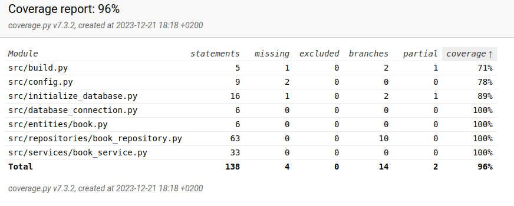

# Testausdokumentti

## Testikattavuus

Kattavuudessa jätetään huomiotta UI:hin liittyvät tiedostot

## Jäljelle jääneitä laatuongelmia

- Kirjan poisto selaus- tai toivelistalta ei anna muuta tietoa poiston onnistumisesta, kuin sen että kirja poistuu listalta. Se ei myöskään ilmota, jos 
yrittää poistaa kirjaa jota ei ole olemassa. 
- Virheilmoituksissa/ onnistumisilmoituksissa on muitakin puutteita