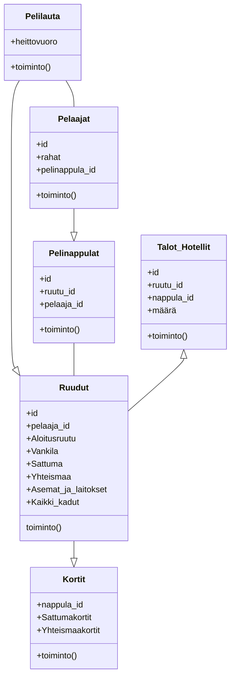

```mermaid
classDiagram
Pelilauta --|> Ruudut
Pelilauta -- Pelaajat
Pelinappulat -- Ruudut
Pelaajat --|>  Pelinappulat
Ruudut --|> Kortit
Talot_Hotellit <|-- Ruudut
Pelilauta : +heittovuoro
Pelilauta : +toiminto()
class Ruudut {
+id
+pelaaja_id
+Aloitusruutu
+Vankila
+Sattuma
+Yhteismaa
+Asemat_ja_laitokset
+Kaikki_kadut
toiminto()
}
class Kortit {
+nappula_id
+Sattumakortit
+Yhteismaakortit
+toiminto()
}
class Pelinappulat {
+id
+ruutu_id
+pelaaja_id
+toiminto()
}
class Pelaajat {
+id
+rahat
+pelinappula_id
+toiminto()
}
class Talot_Hotellit {
+id
+ruutu_id
+nappula_id
+määrä
+toiminto()
}

```
